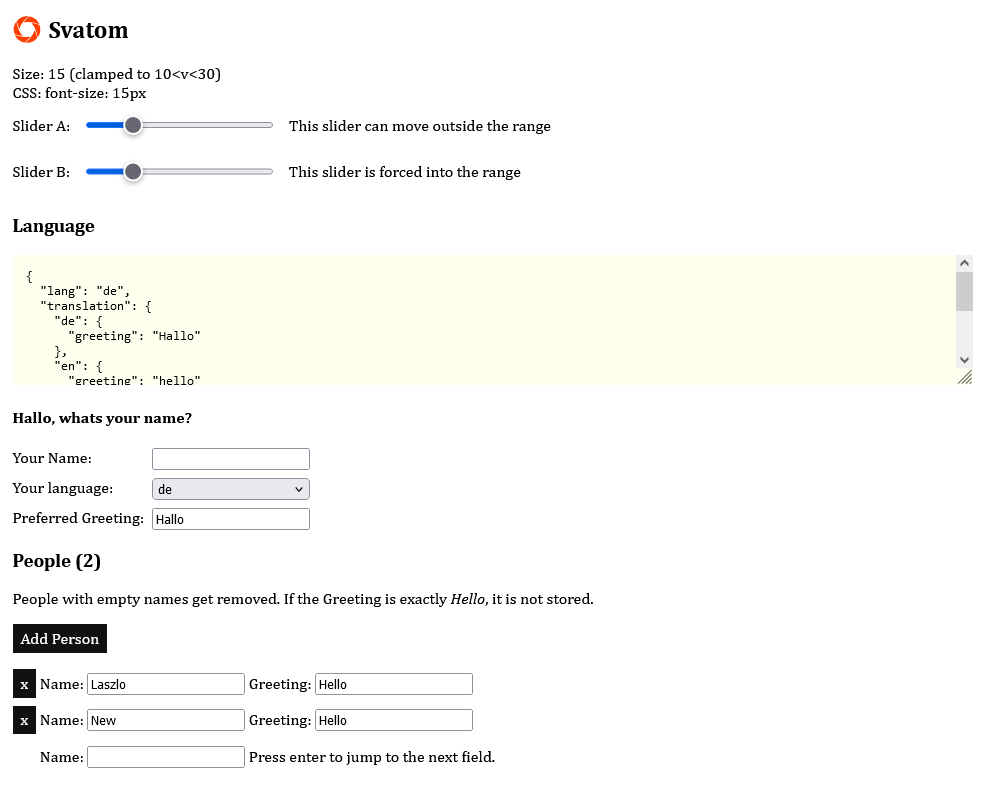

# Svatom

Experiment to apply the [CalmmJs](https://github.com/calmm-js/documentation/blob/master/introduction-to-calmm.md) architecture to Svelte (version 5).

The core idea is to compose [lenses](https://github.com/calmm-js/partial.lenses) for bidirectional data flow.

[Live Demo](https://static.laszlokorte.de/svatom)